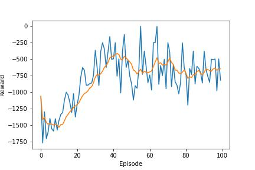
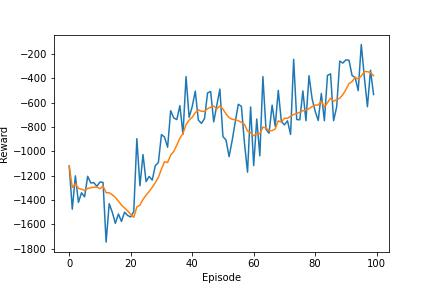

# Reinforcment Learning Playground

The repository serves as a sandbox for basic algorithms, their improvements and new ideas

## [DQN Example](DQN.ipynb)

A simple example of DQN implementation using a Neural Net to solve OpenAI gym environments

### Solution

Solution uses Linear Neural Network 128x512xOUTPUT along with Smooth L1 loss and Adam optimizer

## [Policy Gradient Example](PG.ipynb)

A simple example of Policy Gradient without GAE

## [DDPG Example](DDPG.ipynb)

An implementation of DDPG algorithm used for continuous action space. The notebook contains two types of Replay Buffers:

- Equiprobable Replay Buffer - samples drawn randomly
- Prioritized Replay Buffer (PER) - sample drawn based on priority derived from error rate of experiences

Two experiments were run:

### Standard Replay Buffer

### PER - Prioritized Experience Replay

